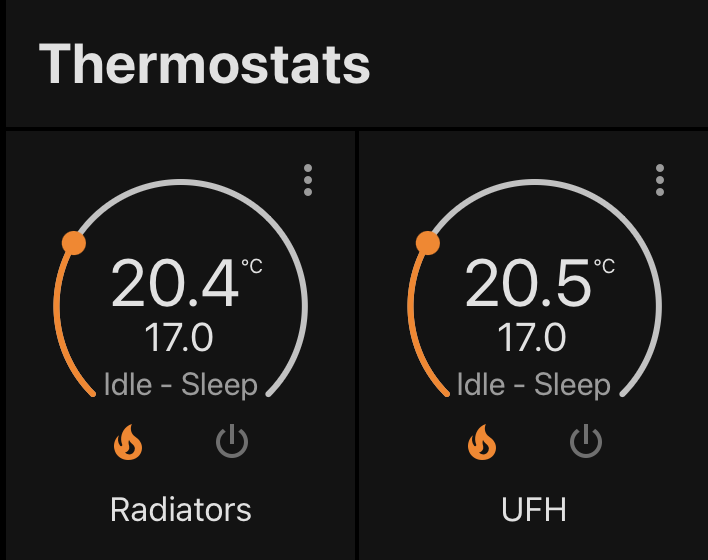
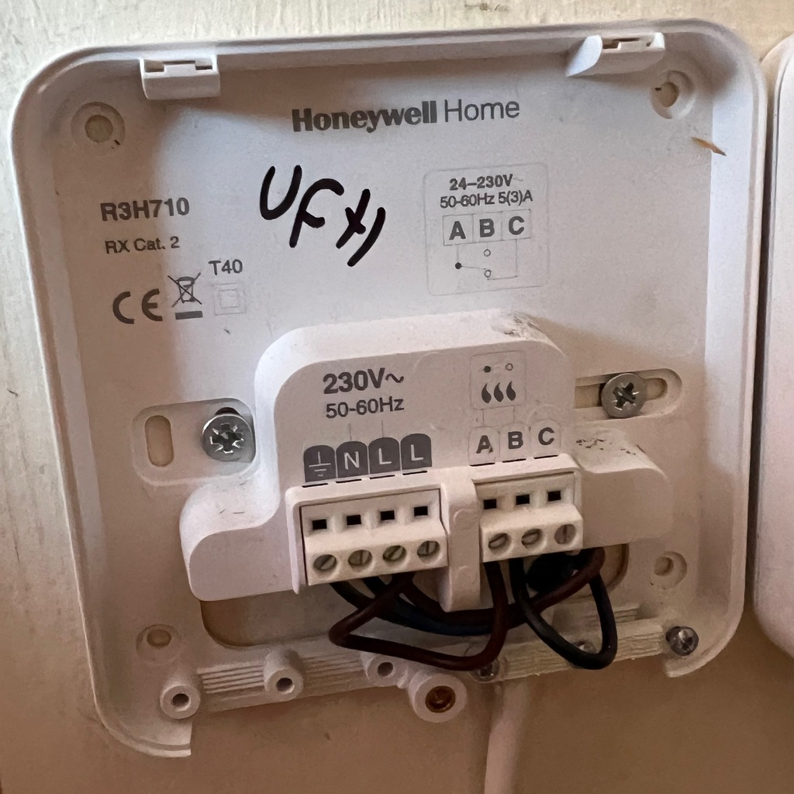
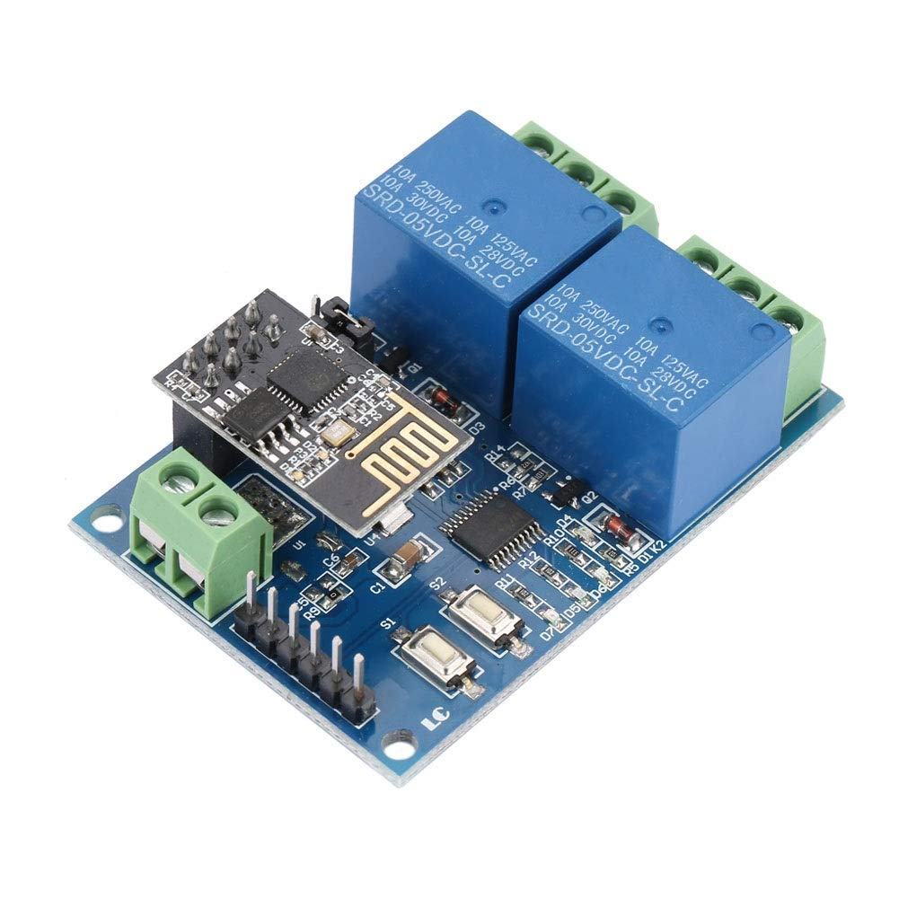
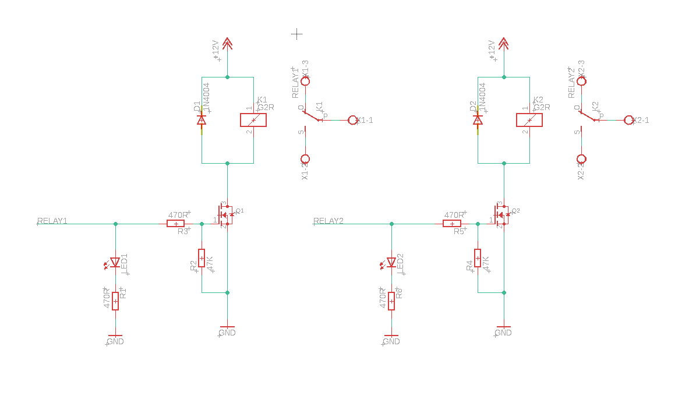
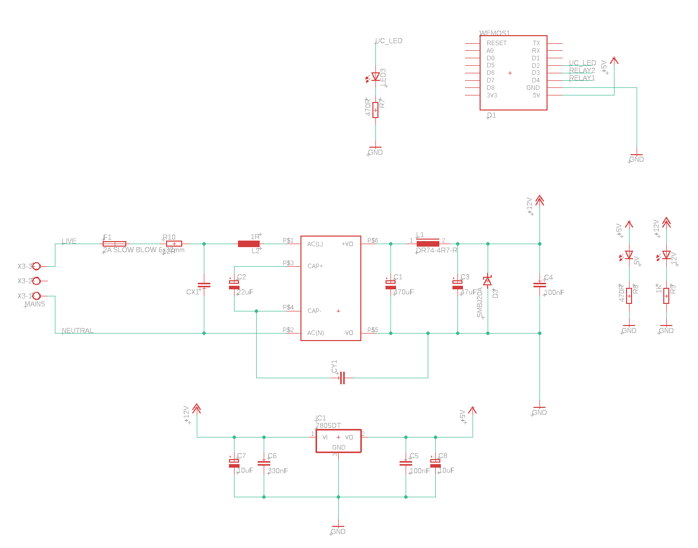

# Motivation
I've been using [Home Assistant](https://www.home-assistant.io) to automate my house, and one of the big things I want to add control of is my heating.
The heating system in my house is a little different to a typical British home in that I have zones, one for upstairs (radiators) and one for downstairs (underfloor heating).
This means a lot of the off-the-shelf thermostat options, especially Google Nest, aren't suitable for me, and what options there are have a prohibitive cost.

A commercial option would be something by Hive, they support multi-zone thermostats and they are supported in HomeAssistant.
Sadly, this option would cost about £300.

Home assistant to the rescue, it has a built-in integration for controlling heating, so long as you provide it a switch to toggle the heating, and a sensor to read the current temperature.
It even has a nice interface.


## My boiler
What are we contending with?
I have a combi-boiler hooked up to a pair of Honeywell thermostats.[^1]
Both thermostats are set up to bridge the 'request for heat' control line on the boiler.
Here's what the thermostat receiver looks like for my underfloor heating.



This interface is pleasingly simple, the controller mounts on top and simply has an RF receiver for the thermostat, and a relay to bridge connect `A` to `B`.
To connect this to home assistant I could just use a generic relay board, like [this](https://www.amazon.co.uk/dp/B07PZ6TZFF/) from Amazon, and flash the ESP8266 with [ESPHome](https://esphome.io).



This solution doesn't please me, though.
I'd need to separately have a mains to 12v power supply to control something which is switching mains voltage.
A quick search didn't yeild anything satisfactory with an integrated power suply, so I am left with only one reasonable choice: build my own at significant expense and time cost, negating any cost saving from not buying the expensive Hive thermostats in the first place.
Okay, it's not quite that bad, the BOM for each of these boards comes to about £50 in small quantities so it's still a lot cheaper, and it can probably be optimised a fair bit.
And no price can be put on the enjoyment I get when designing a PCB.

## Enclosure

First thing's first: the enclosure.
I recently scavenged a bunch of [DIN mounted](https://en.wikipedia.org/wiki/DIN_rail) hardware from an old CNC machine control panel, and I quite like DIN mounting.
A scan of Farnell yielded this bad-boy: 


This supports a reasonable 86.5x68mm PCB in the bottom-most mounting position.

# Circuit design

I need three key things on this board:

 - Power supply, mains to a reasonable DC voltage for some relays
 - ESP8266/ESP32 compatibility
 - Two relays, one for each of my heating zones

I did all the design in Eagle, the CAD files are available [here](https://github.com/graymalkin/esphome-heating-interface).
They are provided without warantee, I'm not a qualified electrical/electronic engineer.
If your house burns down it's between you and your insurer.

## Relays



This is basically a text-book circuit.
I'm using 2N7002 MOSFETs to control the coil on a relay, these FETs are great as they have a very low trigger voltage of about 1v (ideal for 3.3v logic).

## Power supply

This was by far the most difficult part to deal with.
I didn't want to roll my own AC/DC converter or switch mode power supply, so I picked a PCB-mount module.
The first one I selected was very simple, but regrettably £20 ea.
I thought about it and decided to deal with a SIP module with a higher integration complexity (and board footprint), but that was substantially cheaper at £1.86 ea, and about £5 in support components.
The various filter components are what are recommended by the [datasheet]().



In theory I should also add MOV between L and N, but this is optional in the datasheet's application note, and the board I have is quite well populated.
Maybe in REV2.

# ESPHome setup

ESPHome is fantastic for DIY smarthome gadgets.
With just a familiar (at least to Home Assistant users) YAML configuration you can create a binary to run on an ESP32, ESP8266, etc, which will connect to your WiFi and expsose all manor of sensors and actuators to your Home Assistant API.
This project is wildly simple for ESPHome configuration and comprises simply two switches connected to `D3` and `D4` of the D1 mini.
There is also a status LED on `D2`.

```yaml
esphome:
  name: "heating-controller"

esp8266:
  board: d1_mini_lite

# Enable logging
logger:

# Enable Home Assistant API
api:

ota:

light:
  - platform: status_led
    name: "Heating status"
    pin: D2

switch:
  - platform: gpio
    pin: D3
    name: "Underfloor heating"
  - platform: gpio
    pin: D4
    name: "Radiators"

wifi:
  ssid: !secret wifi_ssid
  password: !secret wifi_password

  # Enable fallback hotspot (captive portal) in case wifi connection fails
  ap:
    ssid: "Esphome-Web-0C2621"
    password: "3Hkntq3KmOXA"

captive_portal:
  
```

# It works!

Remarkably, notwithstanding a few minor bugs, the board worked first time!


Now I just need to wire it up to my boiler.

## Bugs with REV1

The footprint for C1 was one size too small, the Panasonic-F capacitor barely fit on the E-pad.
I also forgot to buy the lower value output filter capacitor for the 12V PSU, so that's unpopulated on my board.
I bought the wrong size fuse holders, but they just about worked for the 32x6mm fuse.
The D1 mini has a bright blue LED on `D4`, so moving Relay 2 to something else would be better.

There are two mechanical issues.
The clearance for the D1 mini is not good, it interfers with an internal support on the CMMB/4 enclosure, so it needs to be moved a few millimeters to the west.
The terminal blocks are not well aligned with the holes on the cover for the CMNB/4 enclosure, they need to move south and towards the centre.

## Next revision

Apart from fixing the REV1 bugs there's a couple of things I would do differently in a future revision.

I'll add a couple of pads for connecting a thermal probe, this will make the board useful to people with a water cylinder, especially those who want to automate using solar energy to keep their water hot when possible.
As far as I know, most water cylinders in the UK have two heating elements one top, one bottom, so the dual relay will be useful for that.
I might put the ESP on a daugterboard with a screen for status, and the status LEDs broken out more sensibly.
This will free up a bit of space on the bottom board nicely, and fix that mechanical issue.

There's some minor tweaks to do to the power supply too.
Adding a MOV and a bleed resistor would add a couple of extra types of safety.

# Bill of Materials

-------------------------------------------------------------------------------
Part IDs          Value      Package            Part description
----------------- ---------- -----------        -------------------------------
Enclosure         --         CMNB/4V/Kit        DIN Mount enclosure

C1                470µF      Panasonic E        12V PSU output capacitor

C2                22µF/450V  16mm radius        Mains input cap

C3                47µF       Panasonic D        12V PSU output capacitor

C4, C5            100nF      0603               Linear regulator decoupling

C6                330nF      0603               Linear regulator input
                                                capacitor

C7, C8            10µF       Panasonic B        Linear regulator bulk
                                                capacitance

CX1               Class-X    15mm               Class X mains input capacitor

CY1               Class-Y    10mm               Class-Y mains input capacitor

D1, D2            1n4004     DO41               Relay flyback diode

D3                SMBJ 20V   SMBJ               Over-voltage protection shunt
                                                diode

F1                2A         6x32mm             Fuse, slow blow

IC1               7805       TO252              5V linear regulator

K1, K2            G2R-12                        Omron 12VDC relay

L1                4.7µH      Radial 5mm         12V PSU output filter inductor

L2                1mH        DR74-4R7-R         Mains input filter

LED1, LED2, LED3  Green      1206               LED

Q1, Q2            2N7002E    SOT-23             N-Channel MOSFET

R1, R3, R5, R6,   470R       0603               Resistor
R7, R8

R2, R4            47K        0603               Resistor

R9                1K         0603               Resistor

R10               12R        22mm, 3W           Resistor

SIP               --         MP-LS05-13B12R3    AC/DC converter 12V
-------------------------------------------------------------------------------

The schematics and layout are available on my [GitHub](https://github.com/graymalkin/esphome-heating-interface).

<style>
table{
    border-collapse: collapse;
    margin-bottom: 1em;
}
table thead { border-top: 3px solid black; border-bottom: 1px solid black; }
table tbody { border-bottom: 3px solid black; }
table th, table td{ padding: 0.33em; }
</style>


[^1]: Annoyingly, my boiler made by Worcester Bosch doesn't support the [OpenTherm](https://www.opentherm.eu) standard for communication, only a propietary system that Woscester Bosch supplies. Very frustrating.
