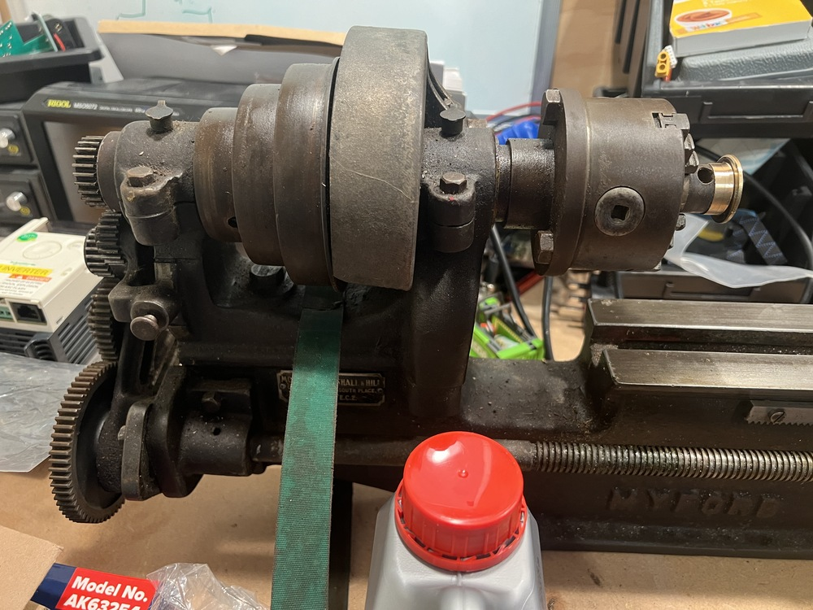
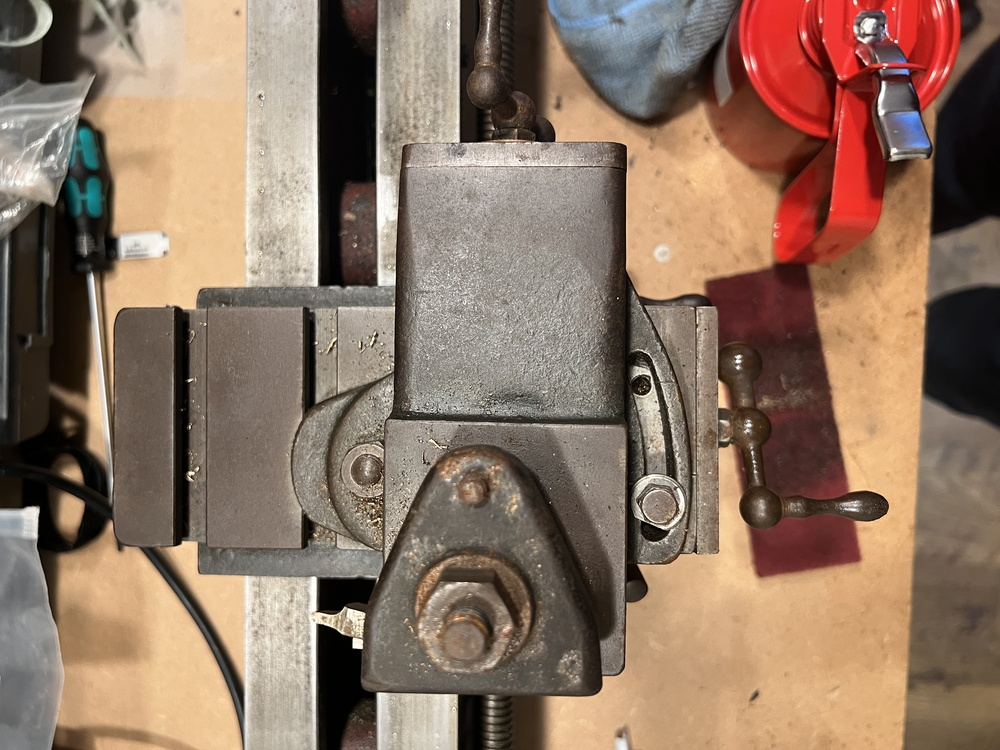
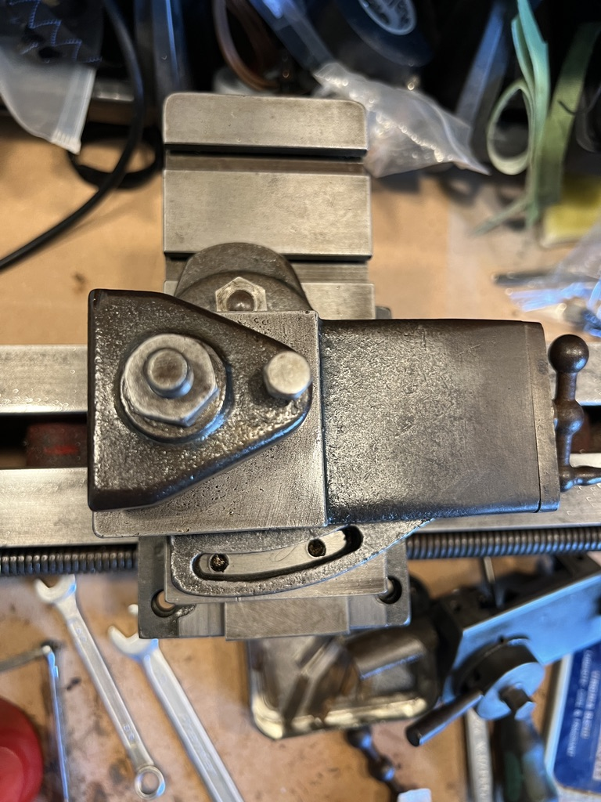
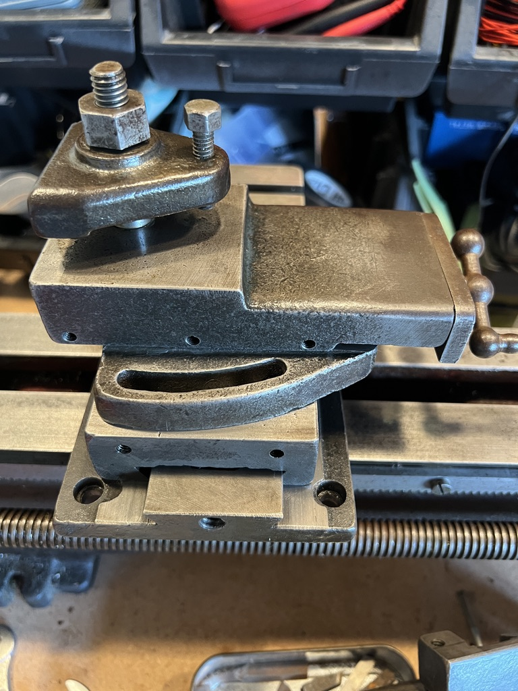
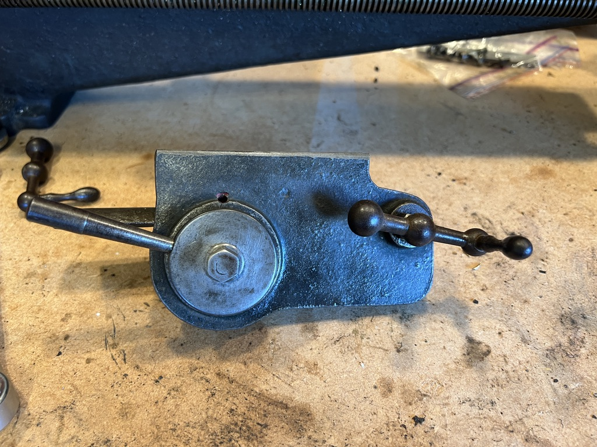

I inherited a ML4 lathe from my late Grandfather.
He'd acquired it as a small shed-lathe when he retired.
After he passed, I moved it from Grandma's house up to Mum's house where it's sat for quite a long time in her garage while I finished my PhD.
She got fed up with it taking up space in her garage, so I finally rented a van and brought it home this autumn.

[{ width=100% }](./images/lathe-front-large.jpg)

The ML4 is small British-made lathe, made in the late 30s/early 40s.
The ML1-4 machines are all very similar and they're not specifically marked by their type, but by my reckoning, this is a ML4 machine:

 - It has a the bolt-on headstock, making it a later ML3 or ML4.
 - It is the larger model with 3½ in. center height making it an ML4 rather than ML3.

Some history on this type of lathe is helpfully provided by [Lathes.co.uk](https://www.lathes.co.uk/myford-ml2-ml4/).
It is a mass produced lathe from Myford produced in the post-war period in Nottingham.

This lathe was sold by Morrison, Marshal & Hill in London, hard to say exactly when.
I do have a copy of the Sales Brochure, and some specs for the change wheels.
I have reproduced the brochure specs and thread cutting charts in the [Appendix](#appendix).

# Condition
The first task is understanding the condition.
The lathe is belt driven, and is designed to operate with an overhead shaft driven by a tool-room engine elsewhere, with flat belts coming down to a set of pulleys to drive the lathe.

The lathe is covered in a gooey mixture of oil and grime from years of storage and some time in a shed.
It needs a good clean all over.
There is a mix of rust damage and some poorly finished castings from the factory.

## Ways
The machine ways had some surface rust, most of it was very light.
A scrub of the ways with some medium scotchbrite pads did the trick.
There is some deeper staining and pitting, but they should not effect the function for the time being.
Once the lathe is in better cleaned up and I can cut a test bar, I will measure the ways and consider sending the bed away for re-surfacing if necessary.

[{ width=45% }](./images/slideways-1-large.jpg)
[{ width=45% }](./images/slideways-2-large.jpg)

The pitting is also on the far-end of the ways.
It looks a little like it might have been home to a cup at some point?
Maybe just a jam-jar with paint brushes...

[{ width=100% }](./images/slideways-pitting-large.jpg)

## Headstock
This lathe has a very simple headstock.
From right to left, there is a Morse Taper 2 spindle nose, here with a 4-jaw chuck installed; simple bearings with oil cups; a set of back gears (under a guard in this photo); 3 drive pulleys for a flat belt; the second spindle bearing; and a feed gear to drive the change wheels.

[{ width=100% }](./images/headstock-large.jpg)

I can feel some play in the spindle bearings.
As with all the bearings in this machine they are simple bearings.
The spindle uses a split pair of white-metal bushings which are clamped in the casting, around the spindle, using a single bolt.
There is a simple oil cup for lubrication.

### Back gear
Not yet inspected.

### Change wheels & lead screw
Roughly inspected.
Gear engagement is poor.
The tumbler works as expected.
I have not dug through the bag of spare parts to check what change gears I have.

## Saddle, cross slide, and compound
An inspection and clean of the sliding surfaces of the saddle, cross slide and compound seemed so-so.
There are some marks and heavier scratches in the several of the sldiing surfaces.
Minor surface rust cleaned up fine with scotchbrite (I was gentle on ground surfaces).
The gibs seem poorly made, there's burs on the angled surfaces.

{ width=100% }

The apron, the part of the lathe which engages the lead screw and feed rack, is filthy.
Perhaps it is normal, but there is a 4th gib on the action to engage the half nut: the lever actuates a cam which slides the half nut parts around the lead screw.
I've not dismantled a lathe apron before to know if this is a common arrangement, but it is neat to me.
The gib screws are in poor condition.

{ width=45% }
{ width=45% }

{ width=100% }

All of the handwheels are in a sorry state.
Very corroded with a rough texture to the hand.

## Tailstock
This feels in rough shape.
There is a dead centre in the tailstock taper which is very much in-there.
I will need to dismantle to get further.
The machined surfaces which run on the ways seem in okay condition.

## Electrics
WIP, photos to follow.

This lathe came with an electric motor.
Its machine plate says it's a 1/6th HP (125W) single-phase motor from Lancashire Cypto.
The motor was dubiously wired into a 10A lighting socket, which in turn was wired into a normal 3-pin plug.

There is a normal feeling amount of end-play in the motor---which is good---but there does seem to be a bit of radial play in the bearings which is a little more concerning.
All the bearings appear to be simple bushings with oil-caps to lubircate, similar to the headstock, but with no adjustment.

# Appendix
_Reproduced here incase it's of use to others._

## A. Change wheel table
NOTE.---

Two collars provided are to be used on the Mandrel and Leadscrew respectively.

A small peice of 3/32-in. steel wire should be used to connect two wheels together on one stud when compoiunding trains of wheels.

+:-------------------------------------------------------------------------------------------:+
|  Whitworth                                                                                  |
+------------+----------+----------------------+-----------------------+----------------------+
| Threads.   | Mandrel  | 1st Stud.            | 2nd Stud.             | Lead Screw           |
+:==========:+:========:+:====================:+:=====================:+:====================:+
| 9          | 40       | Idle wheel           | Idle wheel            | 45                   |
+------------+----------+----------------------+-----------------------+----------------------+
| 10         | 40       | "                    | "                     | 50                   |
+------------+----------+----------------------+-----------------------+----------------------+
| 11         | 40       | "                    | "                     | 55                   |
+------------+----------+----------------------+-----------------------+----------------------+
| 12         | 40       | "                    | "                     | 60                   |
+------------+----------+----------------------+-----------------------+----------------------+
| 14         | 20       | "                    | "                     | 35                   |
+------------+----------+----------------------+-----------------------+----------------------+
| 16         | 20       | "                    | "                     | 40                   |
+------------+----------+----------------------+-----------------------+----------------------+
| 18         | 20       | "                    | "                     | 45                   |
+------------+----------+----------------------+-----------------------+----------------------+
| 20         | 20       | "                    | "                     | 50                   |
+------------+----------+----------------------+-----------------------+----------------------+
| 22         | 20       | "                    | "                     | 55                   |
+------------+----------+----------------------+----------+------------+----------------------+
| 24         | 20       | "                    | Driven   | Driver     | 60                   |
+------------+----------+----------------------+----------+------------+----------------------+
| 25         | 20       | "                    | 25       | 20         | 50                   |
+------------+----------+----------------------+----------+------------+----------------------+
| 26         | 20       | "                    |          |            | 65                   |
+------------+----------+----------------------+----------+------------+----------------------+
| 28         | 30       | "                    | 35       | 20         | 60                   |
+------------+----------+----------------------+----------+------------+----------------------+
| 32         | 30       | "                    | 40       | 20         | 60                   |
+------------+----------+----------------------+----------+------------+----------------------+
| 36         | 30       | "                    | 45       | 20         | 60                   |
+------------+----------+----------------------+----------+------------+----------------------+
| 40         | 30       | "                    | 50       | 20         | 60                   |
+------------+----------+----------+-----------+----------+------------+----------------------+
| Fine feeds |          | Driven   | Driver    |          |            |                      |
+------------+----------+----------+-----------+----------+------------+----------------------+
| 114·4      | 20       | 55       | 30        | 60       | 25         | 65                   |
+------------+----------+----------+-----------+----------+------------+----------------------+
| 171·6      | 20       | 55       | 25        | 60       | 25         | 65                   |
+------------+----------+----------+-----------+----------+------------+----------------------+

&nbsp;

+:-------------------------------------------------------------------------------------------:+
|  Metric                                                                                     |
+----------------+----------+----------------------+-----------------------+------------------+
| Metric Pitch   | Mandrel  | 1st Stud             | 2nd Stud              | Lead Screw       |
+:==============:+:========:+:========:+:=========:+:=========:+:=========:+:================:+
|                |          | Driven   | Driver    | Driven    | Driver    |                  |
+----------------+----------+----------+-----------+-----------+-----------+------------------+
| .5             | 20       | 60       | 65        | 50        | 20        | 55               |
+----------------+----------+----------+-----------+-----------+-----------+------------------+
| .75            | 20       | 55       | 65        | 40        | 20        | 50               |
+----------------+----------+----------+-----------+-----------+-----------+------------------+
| 1.0            | 65       | 30       | 20        | 50        | 20        | 55               |
+----------------+----------+----------+-----------+-----------+-----------+------------------+
| 1.25           | 20       | Idle wheel           | 60        | 65        | 55               |
+----------------+----------+----------------------+-----------+-----------+------------------+
| 1.5            | 20       | "                    | 50        | 65        | 55               |
+----------------+----------+----------+-----------+-----------+-----------+------------------+
| 1.75           | 20       | 55       | 65        | 30        | 35        | 50               |
+----------------+----------+----------+-----------+-----------+-----------+------------------+
| 2.0            | 20       | 55       | 65        | 50        | 40        | 30               |
+----------------+----------+----------+-----------+-----------+-----------+------------------+
| 2.25           | 30       | Idle wheel           | 55        | 65        | 50               |
+----------------+----------+----------------------+-----------+-----------+------------------+
| 2.5            | 40       | "                    | 60        | 65        | 55               |
+----------------+----------+----------------------+-----------+-----------+------------------+
| 2.75           | 40       | "                    | 60        | 65        | 50               |
+----------------+----------+----------------------+-----------+-----------+------------------+
| 3.0            | 40       | "                    | 50        | 65        | 55               |
+----------------+----------+----------------------+-----------+-----------+------------------+

## B. Machine Specifications
_From the catalogue._

### 3⅛ inch Lathe
**Series ML2 with Tumbler Reverse**

+-------------------+----------+----------+--------------------+--------------------+----------+----------+-------------------+
| Center height     |   ..     | ..       | 3⅛ in.             |Cross Slide traverse|   ..     | ..       | 4½ in.            |
+-------------------+----------+----------+--------------------+--------------------+----------+----------+-------------------+
| Length between Centres       | ..       | 14 in.             | Top Slide traverse |   ..     | ..       | 2¾ in.            |
+-------------------+----------+----------+--------------------+--------------------+----------+----------+-------------------+
| Swing over Cross Slide       | ..       | 3⅜ in.             | Lead Screw         |   ..     | ..       | ⅝ in ⨉ 8 t.p.i.   |
+-------------------+----------+----------+--------------------+--------------------+----------+----------+-------------------+
| Swing in Gap      | ..       | ..       | 8½ in.             | Faceplate Diam.    |   ..     | ..       | 6½ in.            |
+-------------------+----------+----------+--------------------+--------------------+----------+----------+-------------------+
| Diam. of Mandrel  | ..       | ..       | 1 in.              | T-s Barrel travel  |   ..     | ..       | 3 in.             |
+-------------------+----------+----------+--------------------+--------------------+----------+----------+-------------------+
| Diam. of Mandrel Nose        | ..       | 1⅛ in. ⨉ 12 t.p.i. | Cone pulleys (alternatively)                                 |
+-------------------+----------+----------+--------------------+--------------------+----------+----------+-------------------+
| Mandrel bored     | ..       | ..       | 19⁄32 in.          | &nbsp; for ½ in. Vee Rope, 3 steps .. 2⅜ in., 3⅛ in., 3⅞ in. |
+-------------------+----------+----------+--------------------+--------------------+----------+----------+-------------------+
| Tailstock bored   | ..       | ..       | ⅜ in. clear        | &nbsp; for ¾ in. Flat Belt, 3 steps .. 2⅜ in., 3⅛ in., 3⅞ in.|
+-----------+-------+----------+----------+--------------------+--------------------+----------+----------+-------------------+
|  Centers: | Headstock        | ..       | No. 2 M.T.         | &nbsp; for 1 in. Flat Belt, 2 steps .. 2½ in. and 3½ in.     |
+           +-------+----------+----------+--------------------+--------------------+----------+----------+-------------------+
|           | Tailstock        | ..       | No. 1 M.T.         | Back Gear Ratio    |   ..     | ..       | 6 to 1            |
+-----------+-------+----------+----------+--------------------+--------------------+----------+----------+-------------------+

Standard Equipment: Set of 10 change wheels; chuck backplate; faceplate; catchplate; headstock and tailstock centres.

Extras: Thread dial indicator; vee-rope; headstock pulley; change wheel guard.

### 3½ inch Lathe
**Series ML4 with Tumbler Reverse**

+-------------------+----------+----------+--------------------+--------------------+----------+----------+-------------------+
| Center height     |   ..     | ..       | 3½ in.             |Cross Slide traverse|   ..     | ..       | 4½ in.            |
+-------------------+----------+----------+--------------------+--------------------+----------+----------+-------------------+
| Length between Centres       | ..       | 22 in.             | Top Slide traverse |   ..     | ..       | 2¾ in.            |
+-------------------+----------+----------+--------------------+--------------------+----------+----------+-------------------+
| Swing over Cross Slide       | ..       | 4⅛ in.             | Lead Screw         |   ..     | ..       | ⅜ in ⨉ 8 t.p.i.   |
+-------------------+----------+----------+--------------------+--------------------+----------+----------+-------------------+
| Swing in Gap      | ..       | ..       | 10 in.             | Faceplate Diam.    |   ..     | ..       | 6½ in.            |
+-------------------+----------+----------+--------------------+--------------------+----------+----------+-------------------+
| Diam. of Mandrel  | ..       | ..       | 1 in.              | T-s Barrel travel  |   ..     | ..       | 3 in.             |
+-------------------+----------+----------+--------------------+--------------------+----------+----------+-------------------+
| Diam. of Mandrel Nose        | ..       | 1⅛ in. ⨉ 12 t.p.i. | Cone pulleys (alternatively)                                 |
+-------------------+----------+----------+--------------------+--------------------+----------+----------+-------------------+
| Mandrel bored     | ..       | ..       | 19⁄32 in.          | &nbsp; for ½ in. Vee Rope, 3 steps .. 2⅜ in., 3⅛ in., 3⅞ in. |
+-------------------+----------+----------+--------------------+--------------------+----------+----------+-------------------+
| Tailstock bored   | ..       | ..       | ⅜ in. clear        | &nbsp; for ¾ in. Flat Belt, 3 steps .. 2⅜ in., 3⅛ in., 3⅞ in.|
+-----------+-------+----------+----------+--------------------+--------------------+----------+----------+-------------------+
|  Centers: | Headstock        | ..       | No. 2 M.T.         | &nbsp; for 1 in. Flat Belt, 2 steps .. 2½ in. and 3½ in.     |
+           +-------+----------+----------+--------------------+--------------------+----------+----------+-------------------+
|           | Tailstock        | ..       | No. 1 M.T.         | Back Gear Ratio    |   ..     | ..       | 6 to 1            |
+-----------+-------+----------+----------+--------------------+--------------------+----------+----------+-------------------+

Standard Equipment: Set of 10 change wheels; chuck backplate; faceplate; catchplate; headstock and tailstock centres.

Extras: Thread dial indicator; vee-rope; headstock pulley; change wheel guard.

_Note: the lead screw diameter seems erroneous. I'll confirm on my lathe, but it's surprising the larger lathe is specified with a smaller Lead Screw._

## C. Bolts and hardware

As I dismantle the lathe and find some hardware in poor condition, I shall try to keep note of its specification for ordering/making replacements down the road.

 - Gib adjustment screws
   - All slotted.
   - Saddle:
   - Cross slide:
   - Compound:

<!-- 0.125 ⅛
0.250 ¼
0.375 ⅜
0.500 ½
0.625 ⅝
0.750 ¾
0.875 ⅞ -->

